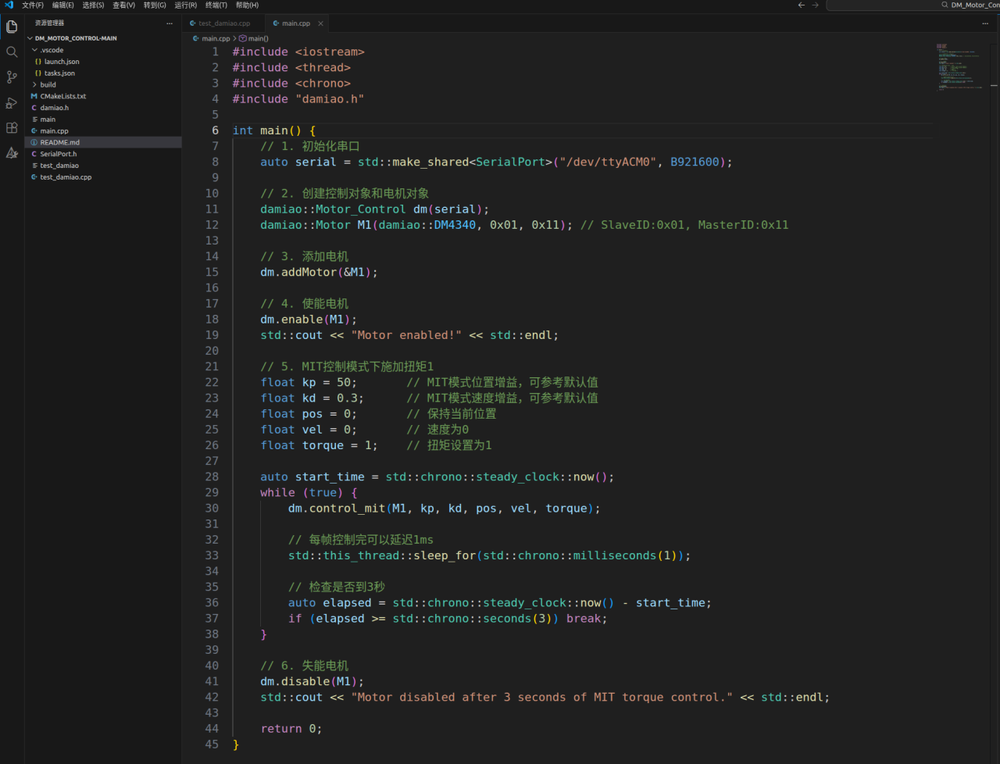
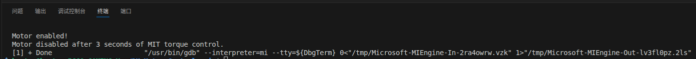
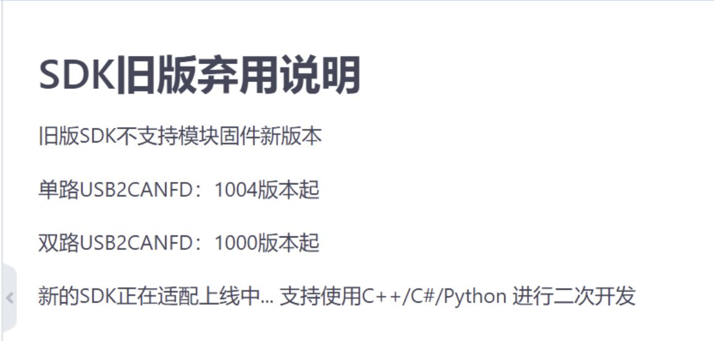
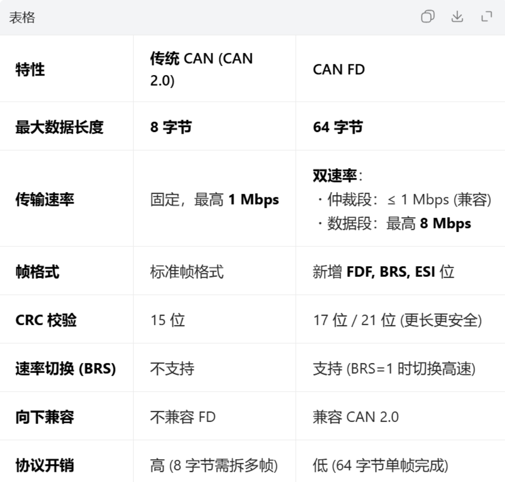
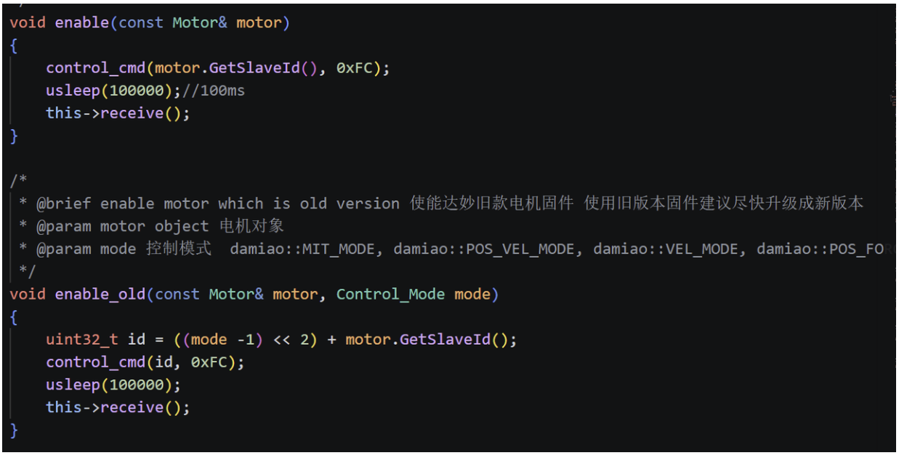
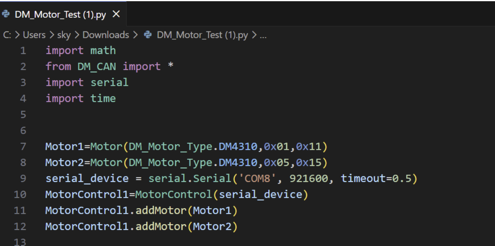
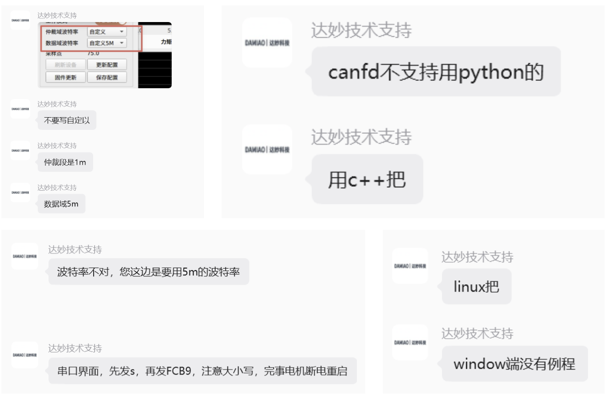

# 2026\-04\-08\_SDK无法使能电机

# 2026\-4\-8 电机调试记录

## 问题描述：

ubuntu22\.04版本使用vscode编写用damiao\.h SDK写的代码时，出现运行代码，程序终端正常输出但电机无任何反应的情况。用上位机可正常控制电机使能和旋转。





## 尝试解决：

1. 怀疑是J4340不支持新版固件，无法使用

```Plaintext
dm.enable(M1)
```

进行使能，必须转为旧版本固件SDK：

```Plaintext
dm.enable_old(M1, damiao::MIT_MODE)
```

（虽然官方文档写着新版本固件是兼容旧版本的）

2. 怀疑代码写错了，接线没接对，虚拟机的问题\.\.\.\.\.\.
3. 怀疑当前的新SDK仍然不支持最新的电机固件：



之前说的新版和旧版对应的是USB2CAN协议的SDK版本，J4340应该是需要USB2CANFD协议的SDK，而这个USB2CANFD协议的新版SDK还没有做出来？



CAN无法兼容CANFD，所以需要编写新的SDK

旧版SDK中关于使能信号的函数：



在网上和其他人交流，获得另一个版本的电机测试用例，不使用damiao\.h库，运行仍无反应



## 最终解决方法：



Ubuntu22\.04，vscode，c\+\+

FW REV: 5\.1\.1\.7

BL REV: 3\.2\.0\.6

FDCAN固件版本: v1\.0\.0\.6

设置仲裁域波特率为1M，数据域波特率5M，使用CANFD协议，电机波特率为5M

正确教程链接：https://gitee\.com/kit\-miao/motor\-control\-routine/blob/master/C%2B%2B%E4%BE%8B%E7%A8%8B/u2canfd/README\.md

成功结果页面：


## 总结：

真的不想吐槽了。达妙的教程太零碎了，光使用SDK的测试用例就有好几版，有直接运行的，有用cmake的，有c\+\+的有python的，有windows的有linux的，有socketcan的有原厂驱动的，有usb2can的也有usb2canfd的；SDK库命名也很混乱\(DM\_CAN和damiao\)；另外，每次修改电机参数都需要重新插拔进入上位机修改，电机和USB2CAN模块都有单独的驱动，驱动管理混乱；最重要的一点，我在官网上找了很久也没有找到关于修改电机波特率参数指令的教程，上位机中也没有一个可视化板块可以修改电机波特率的参数，很多教程也已经过时了。这些种种问题才导致花了两周都没有解决。


以后有问题还是别自己琢磨了，直接找人帮忙吧，省时省力还有效果。

