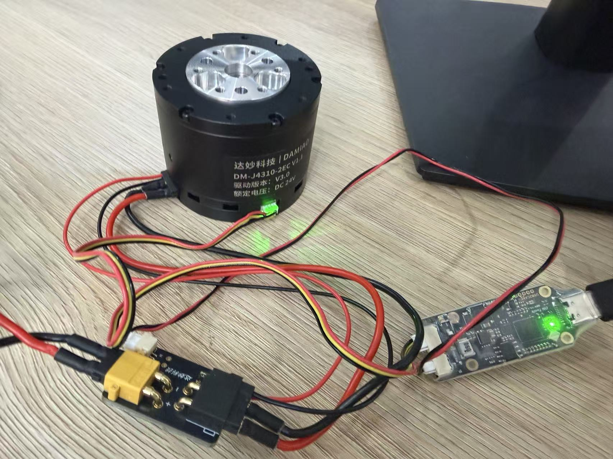
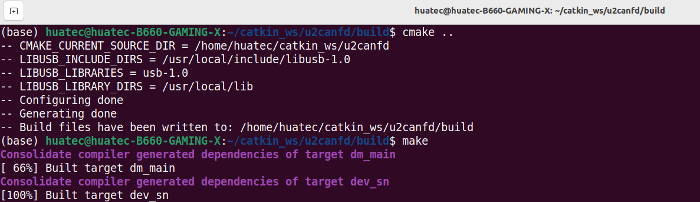
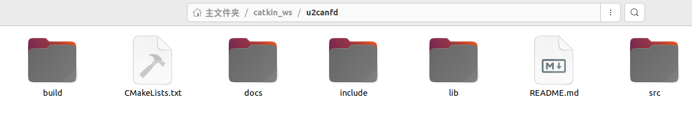
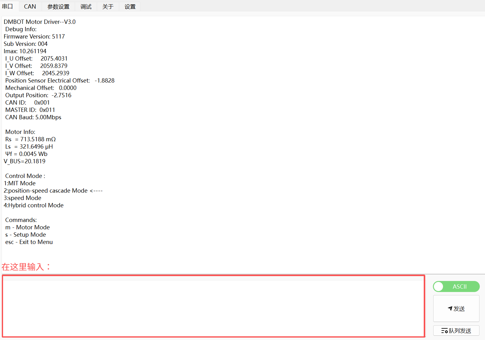
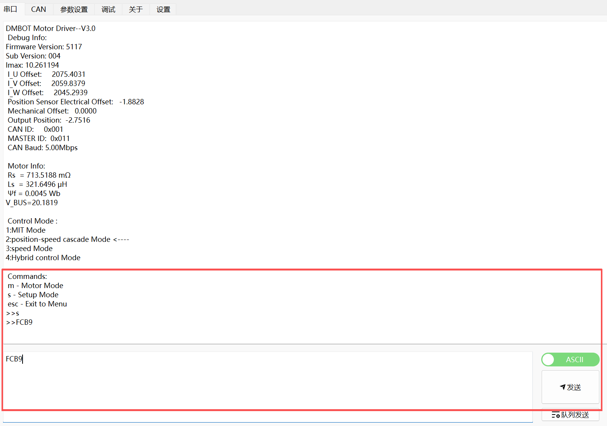
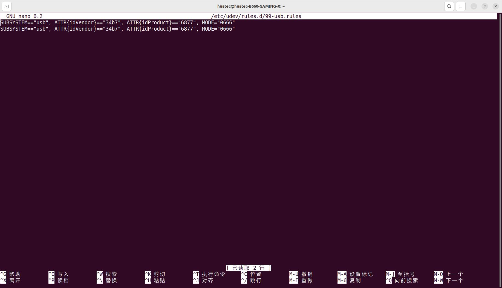
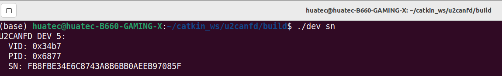
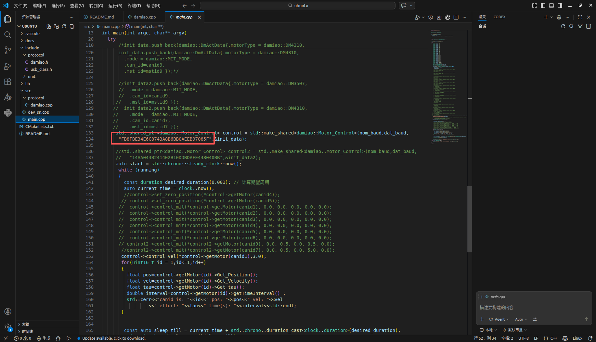
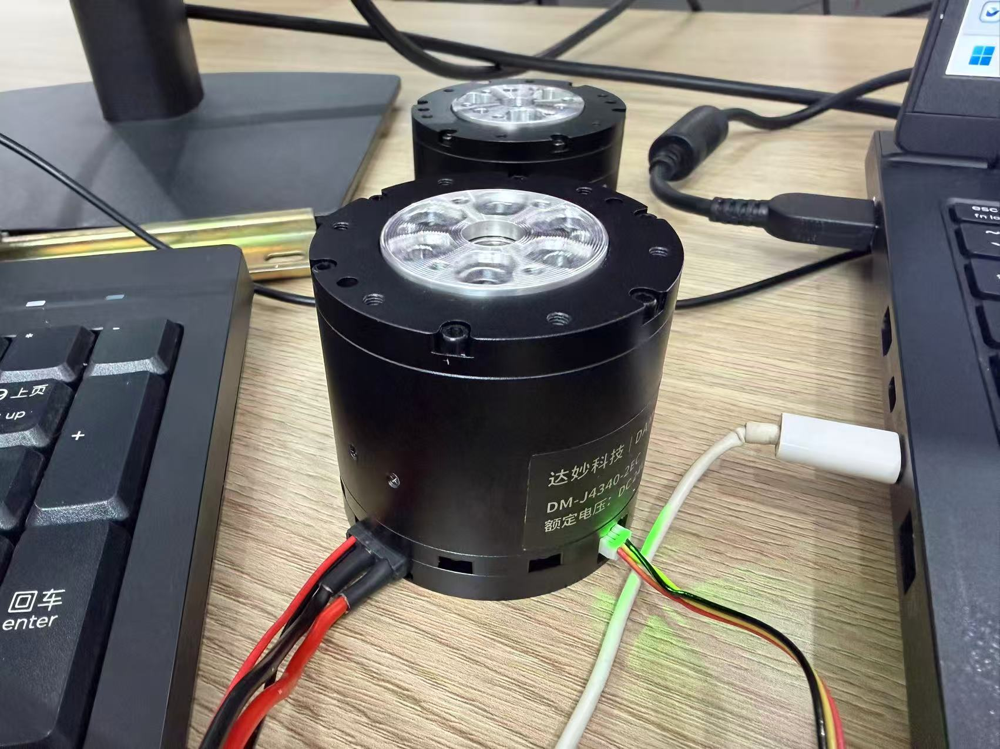
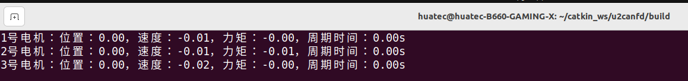

# SDK软件程序

# 接线图：



# SDK库代码控制方法

## 准备阶段

测试环境：Ubuntu22.04

### 一、下载官方SDK测试用例

下载这个zip文件并解压到主目录下：

暂时无法在飞书文档外展示此内容

这个里面的程序是实现最基础的电机测试功能，只要能跑通程序，电机正常旋转，就代表成功了。之后就可以进一步探索多电机协同控制和精确控制等进阶操作了。

### 二、安装libusb插件

先装编译依赖：

```
sudo apt update
sudo apt install -y build-essential pkg-config libudev-dev autoconf automake libtool
```

下载并编译安装：

```
cd /tmp
wget ``https://github.com/libusb/libusb/releases/download/v1.0.29/libusb-1.0.29.tar.bz2
tar -xjf libusb-1.0.29.tar.bz2
cd libusb-1.0.29
./configure
make -j$(nproc)
sudo make install
```

安装完后刷新动态库缓存：

```
sudo ldconfig
```

检查版本：

```
pkg-config --modversion libusb-1.0
```

确保输出为1.0.29

### 三、创建一个工作空间

打开之前下载好的catkin_ws文件，右键，点击“在终端打开”。

接着在终端进行编译操作：

```
mkdir build
cd build
cmake ..
make
```





### 四、 修改电机波特率（重要！）



先输入s进入Setup Mode

再输入FCB9，注意大小写，输入后电机断电重启

这样就行：



### 五、给USB转CANFD设备设置权限

在终端输入：

```
sudo nano /etc/udev/rules.d/99-usb.rules
```

然后写入内容：

```
SUBSYSTEM=="usb", ATTR{idVendor}=="34b7", ATTR{idProduct}=="6877", MODE="0666"` `SUBSYSTEM=="usb", ATTR{idVendor}=="34b7", ATTR{idProduct}=="6632", MODE="0666"
```

ctrl+o写入，ctrl+x退出，按y并回车保存



输入指令重新加载：

```
sudo udevadm control --reload-rules` `sudo udevadm trigger
```

*注意：这个设置权限只需要设置1次就行，重新打开电脑、插拔设备都不需要重新设置

### 六、修改serial编号

然后需要通过程序找到USB转CANFD设备的Serial_Number，在你刚刚编译的build文件夹中打开终端运行dev_sn文件:

```
cd ~/catkin_ws/build` `./dev_sn
```



上面图片里的SN后面的一串数字就是该设备的的Serial_Number，

接着复制该Serial_Number，打开main.cpp，替换程序里的Serial_Number，如下图所示：



保存即可

## 程序运行

重新编译，打开终端输入：

```
cd ~/catkin_ws/build` `make
```

在你刚刚编译的build文件夹中打开终端运行dm_main文件:

```
cd ~/catkin_ws/build` `./dm_main
```

此时你会发现电机亮绿灯，并且旋转





# 总结

使用SDK进行底层二次开发是深入学习电机控制不可或缺的一步，这一步会比单纯使用上位机调试复杂很多，调试过程可能会非常痛苦，会问无数次ai报错原因，不断修修补补，调整各种版本参数，才可以把这个SDK跑通。
