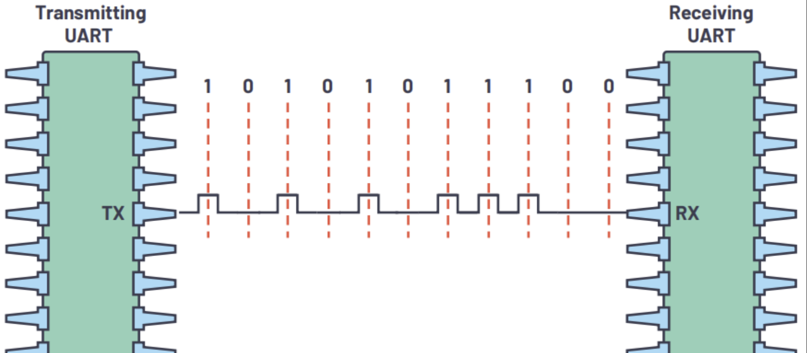

# 有什么用？

计算机和外界需要沟通，这个沟通不是靠意念，而是通过一种语言系统。这个系统是计算机的专属语言，每个人只要想跟计算机交流就必须先学会它，每次跟计算机交流也必须说这门语言，这个语言就是我们所说的通信协议。计算机的世界其实也和人类世界相似（毕竟科学家的设计灵感也是从现实世界获得的），设计这个东西的初衷也是为了在计算机的世界立好规矩，让全世界的计算机都能说“中国话”，这样大家一起工作才方便快捷。

# 通信协议长什么样子？

这里的 “10101011100” 就是计算机的语言，中间的黑色像长城轮廓的线就是计算机语言的载体，也就是信号。计算机想说“1”，就只需要通电，电压高了就代表1；同理，计算机想说“0”，就只需要断电，没电了的状态就代表0。

# 有哪些主流的通信协议？

| 协议 | 用几根线                   | 通信方式                     | 难度     | 常见应用                   |
| ---- | -------------------------- | ---------------------------- | -------- | -------------------------- |
| UART | 2根（TX, RX）              | 点对点（两个设备直接通信）   | ⭐ 最简单 | 串口调试、单片机与模块通信 |
| I2C  | 2根（SDA, SCL）            | 多设备（一个主机对多个设备） | ⭐⭐       | 传感器、存储芯片           |
| SPI  | 4根（MOSI, MISO, SCK, CS） | 主从通信（主机控制多个设备） | ⭐⭐⭐      | 屏幕、Flash存储            |
| CAN  | 2根（CAN_H, CAN_L）        | 多设备（大家共享一条总线）   | ⭐⭐⭐⭐     | 汽车系统、工业控制         |

# CAN总线

## 介绍

Controller Area Network（控制器局域网络）最早由 Bosch 在汽车领域提出，现在已经成为工业和机器人中的标准通信方式。CAN支持多个设备共享一条“抗干扰、可仲裁”的通信，比如电机，MCU，传感器都可以挂在同一条 CAN 总线上使用。

## 原理特点

#### 差分信号

CAN使用两根线：CAN_H和CAN_L，信号靠电压差判断，这样外界噪声同时影响两根线，通过差分就能被抵消

#### 多主通信（异步，半双工）

所有节点都可以发数据，没有“主从”，谁都可以说话。

优先级仲裁：当多个设备同时发送：ID 越小——优先级越高

## CAN报文结构

| ID （标识符） | RTR （远程传输请求） | IDE （标识符扩展） | DLC （数据长度代码） | DATA （数据段） | CRC （循环校验） | ACK （确认位） |
| ------------- | -------------------- | ------------------ | -------------------- | --------------- | ---------------- | -------------- |
| 11 bit        | 一般都是0            | 1 bit              | 4 bit                | 0-64 bit        | 15+1(分隔符) bit | 2bit           |

## 什么是 CAN 总线？

CAN 的全称是 **Controller Area Network**，中文叫 **控制器局域网络**。

它最早由 Bosch 公司为汽车电子系统设计。汽车里面有很多电子设备，比如发动机控制器、刹车系统、仪表盘、车门控制器等。如果每两个设备之间都单独拉线，线路会非常复杂。

CAN 总线的作用，就是让多个设备通过**同一组通信线**进行数据交流。

可以把 CAN 总线想象成一个“班级讨论群”：

-  每个设备都像群里的一个同学； 
-  大家都可以发消息； 
-  所有人都能看到消息； 
-  但只有需要这条消息的设备会处理它。 

现在 CAN 不只用于汽车，也广泛用于工业控制、机器人、电机驱动、传感器网络等场景。

## CAN 总线为什么常用？

CAN 总线有几个很重要的优点：

### 1）抗干扰能力强

CAN 使用两根通信线：

- **CAN_H**
- **CAN_L**

它不是只看某一根线上的电压，而是看两根线之间的**电压差**。

这种方式叫做**差分信号**。

简单来说，外界干扰通常会同时影响 CAN_H 和 CAN_L。因为 CAN 只关心两根线之间的差值，所以很多干扰可以被抵消掉。

所以 CAN 很适合用在汽车、工厂、电机附近这些电磁干扰比较强的环境中。

### 2）多个设备可以共用一条总线

CAN 总线上可以接很多设备，例如：

-  MCU 控制板 
-  电机驱动器 
-  传感器 
-  显示屏 
-  电池管理系统 

它们不需要一对一连接，而是都接到同一条 CAN 总线上。

这样可以减少线束数量，使系统结构更简单。

### 3）没有固定主机，所有节点都可以发送数据

CAN 是一种**多主通信**方式。

也就是说，总线上没有一个固定的“老大”专门负责指挥通信。每个节点都可以在需要的时候发送数据。

例如：

-  温度传感器可以主动发送温度； 
-  电机驱动器可以主动反馈转速； 
-  控制器也可以主动发送控制命令。 
