# 多机协同控制（三轴机械臂）

# 一、多机控制基础例程

\[catkin\_ws\.zip\]

先把这个文档下载解压到自己的主目录下：

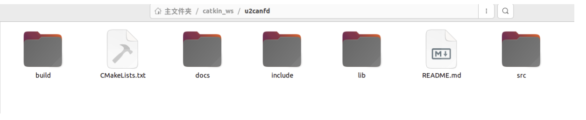

## 1\.1 基本概述

整个多电机的控制链路是这样的：

电脑 Ubuntu \-\> USB2CANFD 设备 \-\> CANFD 总线 \-\> 多个达妙电机

每个电机要有两个重要 ID，相当于电机在计算机里的名字：

can\_id：电脑发命令时找这个电机

mst\_id：电机反馈数据时使用的 ID

计算机通过识别这两个ID来辨别控制的到底是哪个电机

一般会将can\_id设置为0x01,0x02,0x03\.\.\.\.\.根据电机数量依次编号，mst\_id则会在can\_id的基础上加10，设置为0x11,0x12,0x13\.\.\.\.\.

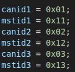

## 1\.2 安装编译

`cd ~/catkin_ws/u2canfd`

`mkdir -p build`

`cd build`

`cmake ..`

`make`

build文件夹里面会这里会生成两个程序：

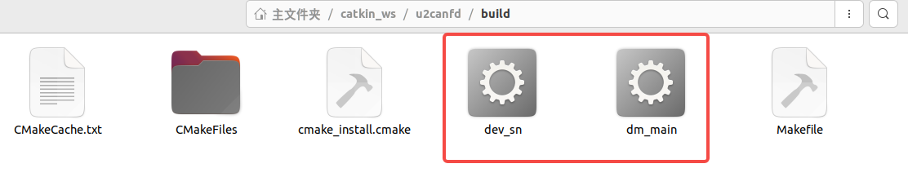

\./dev\_sn     \# 查 USB2CANFD 设备序列号

\./dm\_main    \# 真正控制电机运动

相当于把cpp文件通过make的方式打包成一个可直接运行的程序了，更加方便规范，这一步后面会频繁使用，每修改依一次程序或者配置都需要进行这一步

## 1\.3 接口配置

打开终端，写入接口权限：

`sudo nano /etc/udev/rules.d/99-usb.rules`

写入：

`SUBSYSTEM=="usb", ATTR{idVendor}=="34b7", ATTR{idProduct}=="6877", MODE="0666"`

`SUBSYSTEM=="usb", ATTR{idVendor}=="34b7", ATTR{idProduct}=="6632", MODE="0666"`

然后执行：

`sudo udevadm control --reload-rules`

`sudo udevadm trigger`

接着要找到SB2CANFD 的 SN，这时候需要把接口接上电脑

`cd ~/catkin_ws/u2canfd/build`

`./dev_sn`

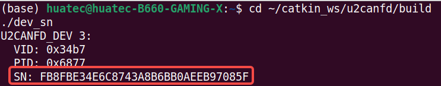

把输出里的SN填到 main\.cpp文件里面：

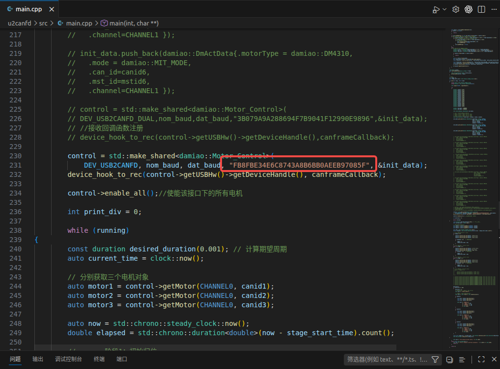

## \*1\.4 代码逻辑（初学者可直接略过，先去把程序跑通）

首先对电机进行初始化：

`std::vector<damiao::DmActData> init_data;`

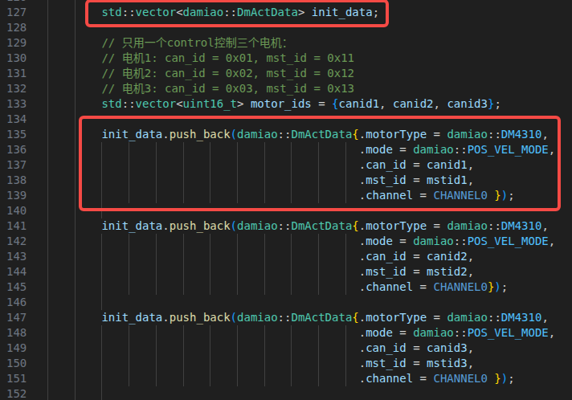

每加入一个电机，就 push\_back 一次，并设置各项参数：

motorType：电机型号，比如 DM4310

mode：控制模式，比如 POS\_VEL\_MODE

can\_id：电机 CAN ID

mst\_id：反馈 ID

channel：接在哪一路 CAN，单路一般 CHANNEL0

接着就可以对电机进行使能：

这一步成功后，一般电机会亮绿灯

数据会通过这个函数反馈回来：

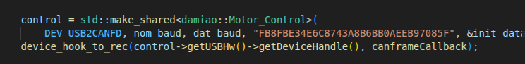

## 1\.5 控制参数修改

while里就是让不断发指令让电机运行的代码：

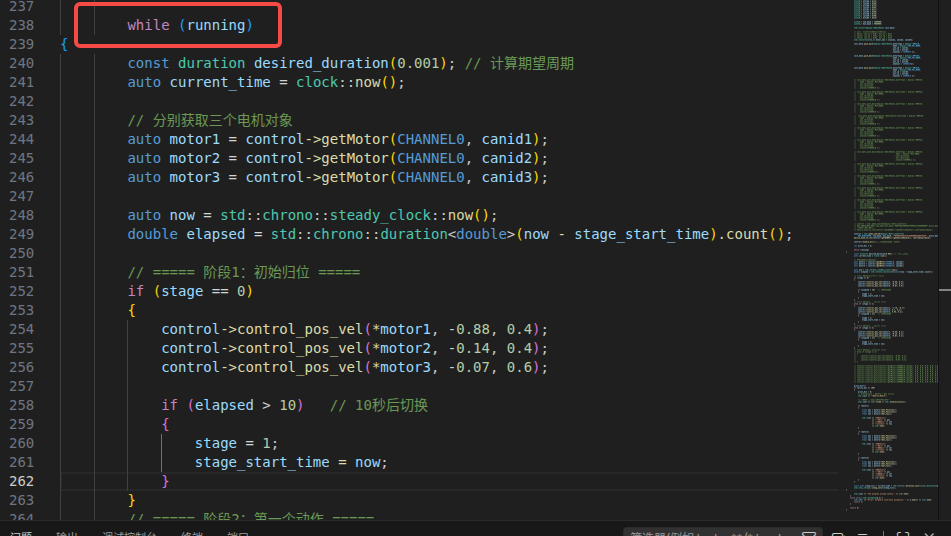

通过这一行代码控制电机：

`control->control_pos_vel(*motor1, -0.88, 0.4);`

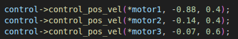

这是pos\_vel模式，代码位置速度模式，如果想设置其他的模式需要修改代码，具体实现方式到damiao\.cpp里面查找：

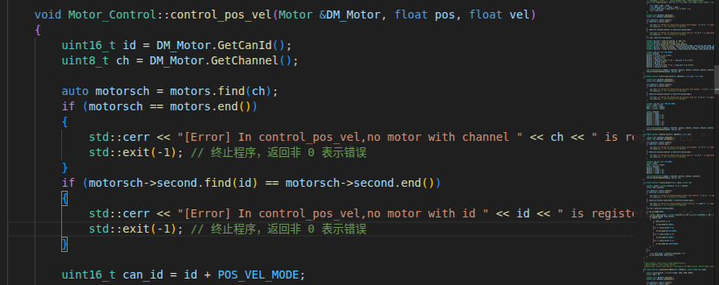

motor1：控制哪个电机

\-0\.88：目标位置，单位通常按电机协议为 rad

0\.4：目标速度限制

位置速度模式最简单，只需要设置一个位置点位值，并且设置到达这个点位的速度就可以让电机动起来

## 1\.6 运行

重新在build文件夹内打开终端，输入：

`make`

运行：

`./dm_main`

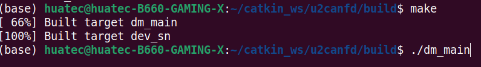

# 二、使用ROS2控制多电机

\[damiao\_ws\.zip\]

用ROS2来控制电机的方法会复杂很多，官方也没有给出具体的实现例程，只有靠自己手搓一个出来，难免在配置上会出现一点点兼容性问题，这时候就需要问一问ai帮忙稍微修改一下文件了

## 2\.1 基本概述

首先需要知道ROS2大致的工作原理：

ROS 2里最重要的单位叫 **node**，节点。一个节点就是一个正在运行的程序

一个机器人系统通常不是一个大程序，而是很多节点一起工作，每一个节点都有自己的任务做：

节点 A：读取电机状态

节点 B：发布控制命令

节点 C：发布机器人模型

节点 D：记录数据

节点 E：可视化状态

这些节点之间需要相互传递信息参数，最常见的通信方式就是用**topic**通信。Topic 可以理解成一个广播频道，各个节点往里面发送消息，这个过程就叫 **publish**，另一个节点从里面接收消息，就叫 **subsrcibe**

另外还有一个名词叫 **message**，这个就是在topic里面传递的数据信息

还有一个知识是**launch**文件，这个文件的作用就是可以一次启动多个节点，实际机器人系统往往需要同时启动很多节点，如果每个节点都手敲命令，会很麻烦，所以需要 launch 文件

比如运行一个launch文件：

`ros2 launch damiao_description damiao_ros2_control.launch.py`

它会自动启动ros2\_control\_node，robot\_state\_publisher，joint\_state\_broadcaster\.\.\.\.这些node节点，所以launch文件可以理解成机器人启动脚本

另外还有一个专业名词叫**package**，在ROS2里面，不是随便放文件，而是按 package来管理的，比如这个工程里面就用了两个package，damiao\_hw 负责硬件通信，damiao\_description 负责配置和启动，编译时ROS2会编译 package，编译后要source一下

## \*2\.2 代码逻辑

这个项目是让我的三轴机械臂能始终保持一个预设姿态的弹性阻抗。

整个代码工程的主要文件是这样的：

motors\.yaml 配电机参数

damiao\_test\.urdf\.xacro 生成多个 joint

damiao\.ros2\_control\.xacro 把 joint 暴露给 ros2\_control

dm\_hw\.cpp 负责真正读写达妙电机

damiao\_ros2\_control\.launch\.py 启动控制器

elastic\_hold\_node\.py 给每个电机持续发布 MIT 控制指令

分别打开两个终端输入如下指令：

`ros2 launch damiao_description damiao_ros2_control.launch.py`

启动底层 ros2\_control 硬件控制系统

`ros2 run damiao_description elastic_hold_node.py --ros-args --params-file src/damiao/damiao_description/config/elastic_hold.yaml`

启动上层弹性保持控制节点

就能实现定点的弹性阻抗了

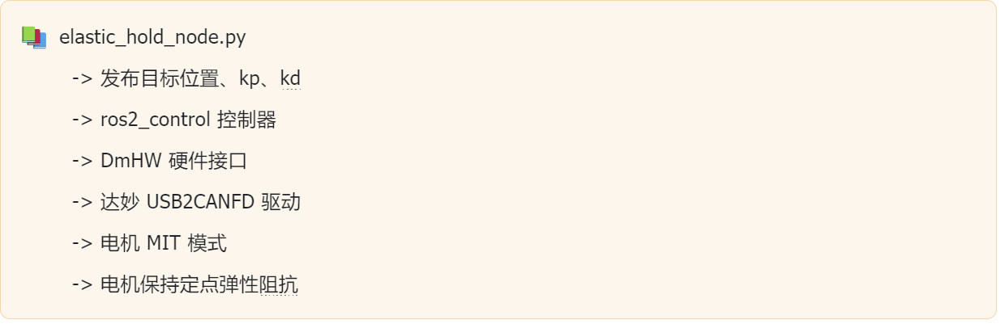

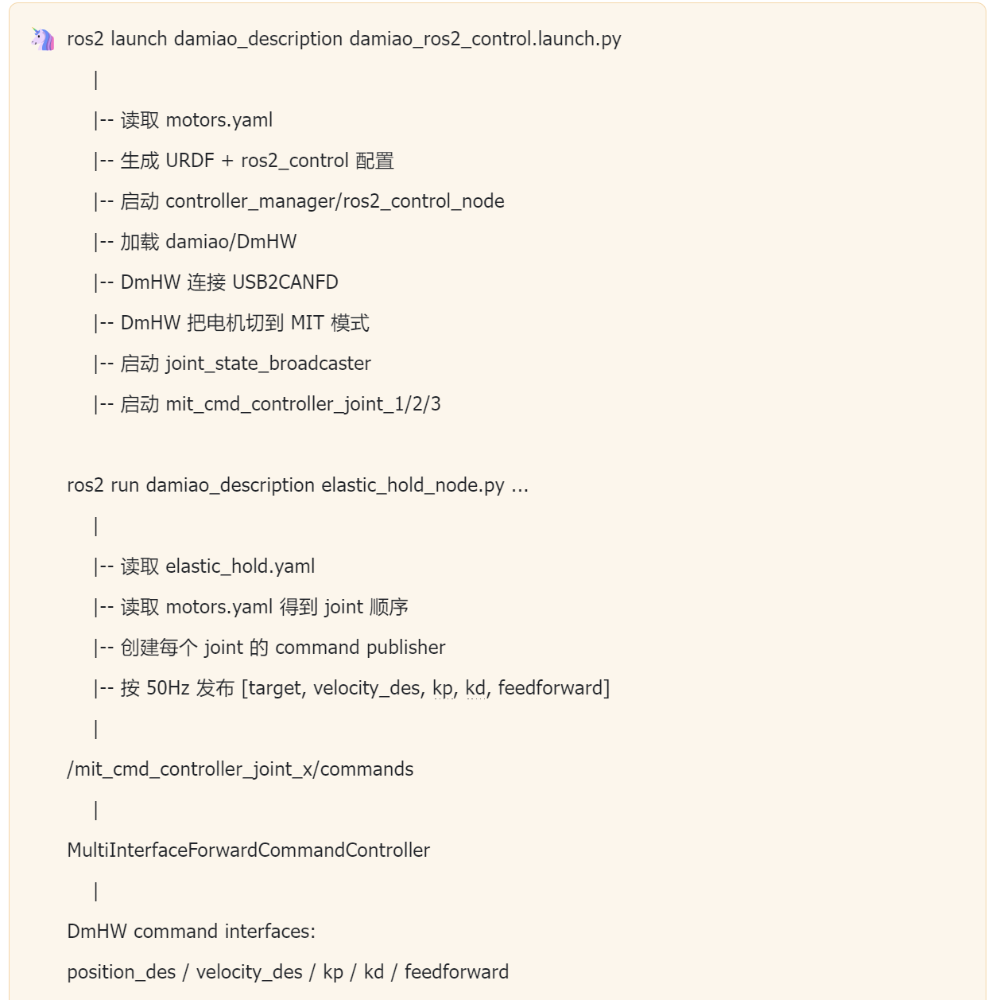

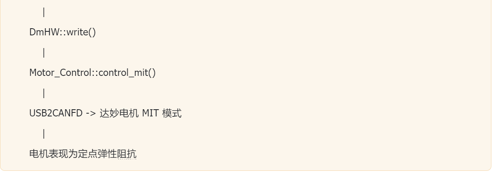

电机表现为定点弹性阻抗

## 2\.3 控制参数修改

### 2\.3\.1 修改电机模型参数

打开damiao/damiao\_description/motor\.yaml文件，里面是对电机的配置文件：

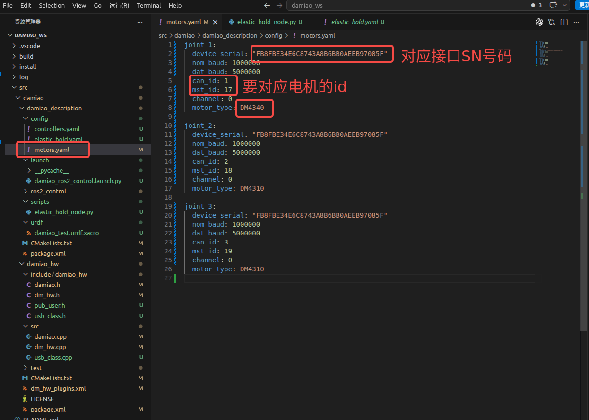

一个joint对应着一个电机，如果有三个电机那就需要三个joint，并且joint的位置要和URDF文件内的保持一致，我的文件中和实物是这样的：

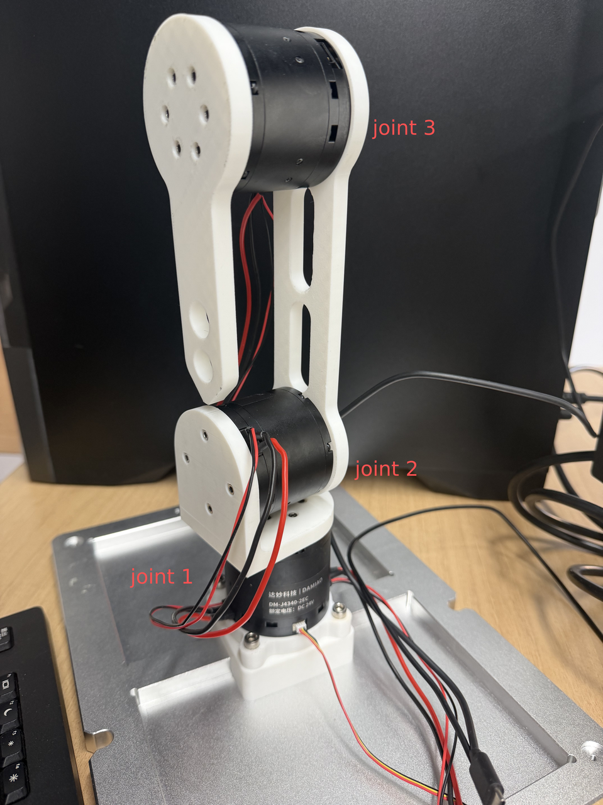

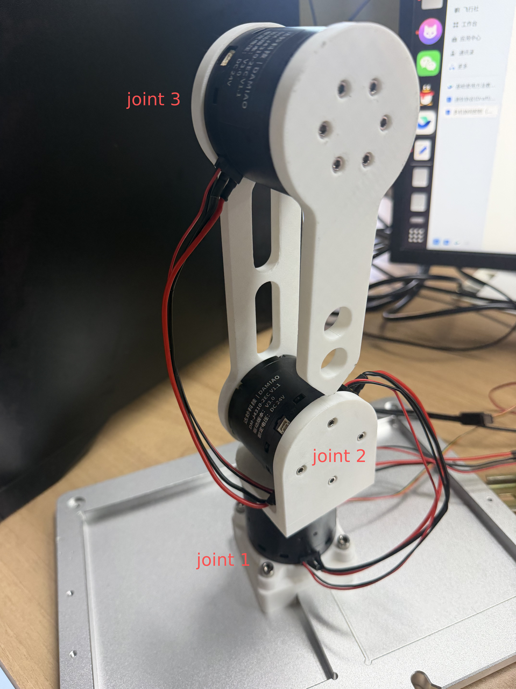

电机的id需要通过上位机进行设置，具体设置方法请参考基础使用方法篇\-上位机控制

另外，硬件接线方面，需要给最底层的电机接三根线，一根UART线接USB2CANFD串口用来获取基础信息，一根CAN线接转换模块获取指令，最后一根CAN线接上层的电机。上层的两个电机接线更简单，只需要接一个CAN线就行，CAN线的连接和使用有点像电路串联。

### 2\.3\.2 修改运动位置参数

打开damiao/damiao\_description/elastic\_hold\.yaml文件，里面是对电机的姿态和运行模式配置文件：

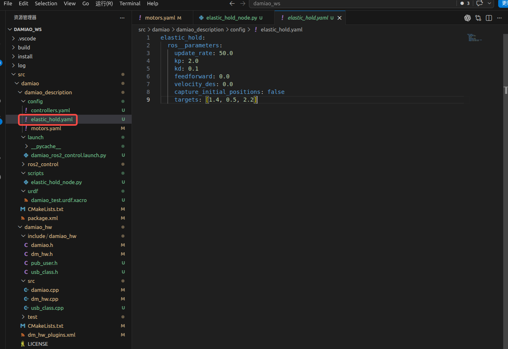

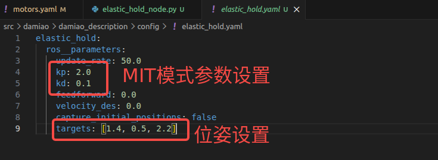

电机的姿态位置需要自己写一个脚本订阅电机参数topic查看：

先启动底层控制：

`cd ~/damiao_ws`

`source install/setup.bash`

`ros2 launch damiao_description damiao_ros2_control.launch.py`

然后新开一个终端：

`cd ~/damiao_ws`

`source install/setup.bash`

`ros2 topic echo /joint_states`

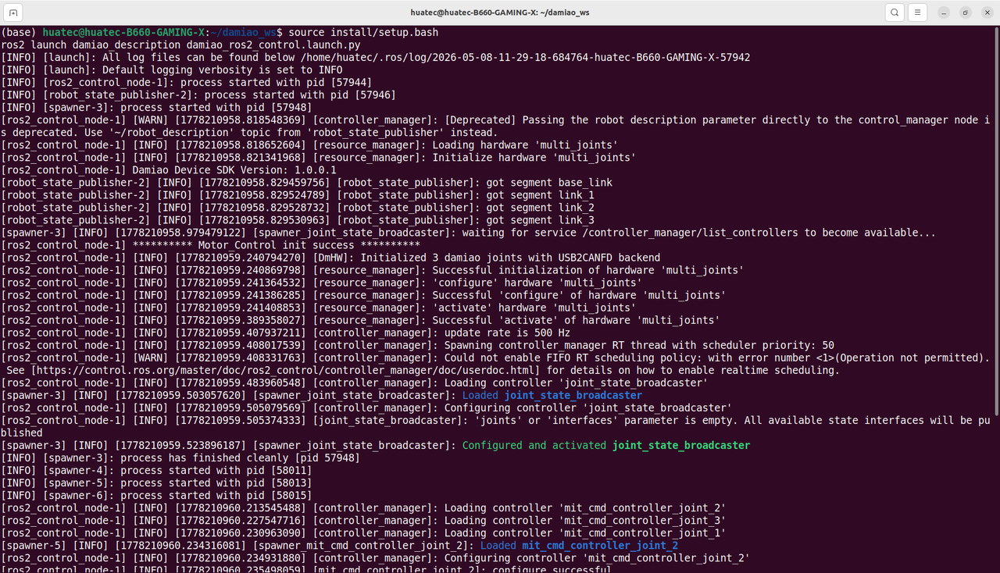

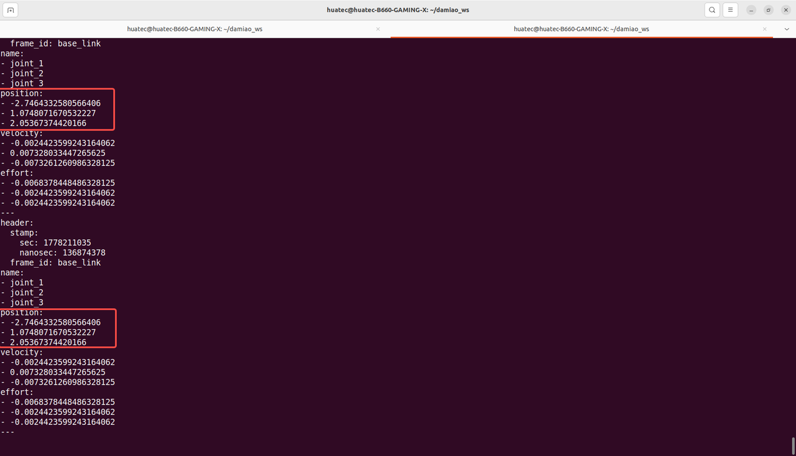

这样就可以查看电机位置对应的姿态数值了

接下来就根据需要修改target里面的参数了，targets 的顺序必须和 motors\.yaml 里的关节顺序一致，现在的逻辑是 elastic\_hold\_node\.py 读取 motors\.yaml 的 key 顺序，所以通常就是：joint\_1——joint\_2——joint\_3

## 2\.4 运行

打开一个终端输入：

`cd /home/huatec/damiao_ws`

`source install/setup.bash`

`ros2 launch damiao_description damiao_ros2_control.launch.py`

再打开一个新的终端，同样的输入：

`cd /home/huatec/damiao_ws`

`source install/setup.bash`

`ros2 run damiao_description elastic_hold_node.py --ros-args --params-file src/damiao/damiao_description/config/elastic_hold.yaml`

就可以看到电机会转到一个位置并保持不动了

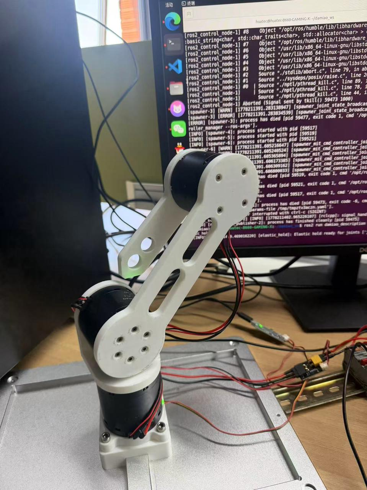

